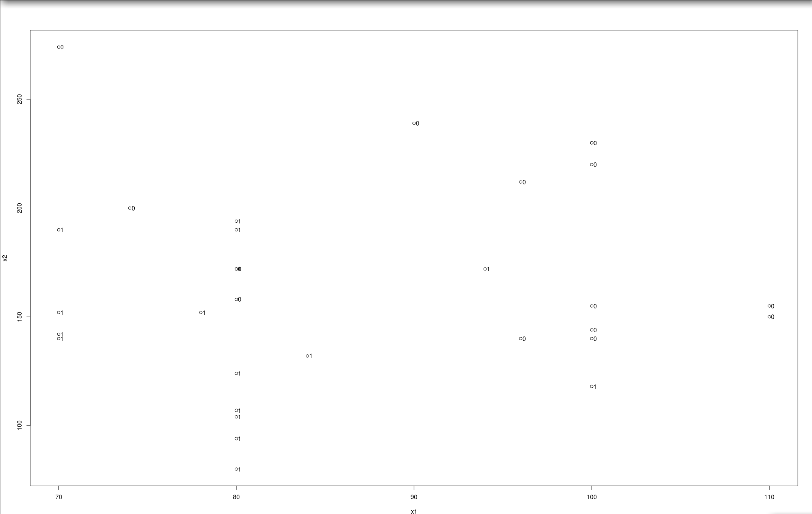
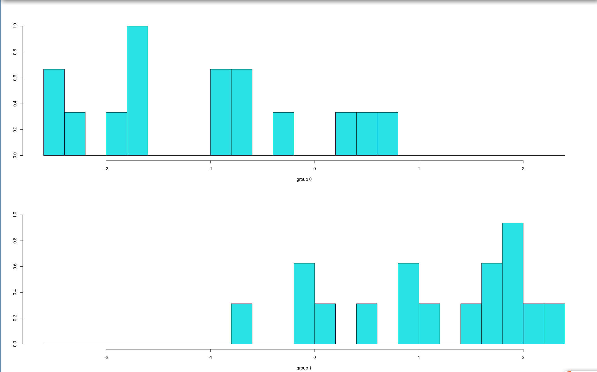

## 思考练习题5：
## 3)
(1) Logist建模如下

```R
library('openxlsx')
d5_3 = read.xlsx('mvexer5.xlsx', 'E5.3')
logit.glm <- glm(G~x1+x2, data=d5_3)
summary(logit.glm)
```

运行结果

```
Call:
glm(formula = G ~ x1 + x2, data = d5_3)

Deviance Residuals: 
    Min        1Q    Median        3Q       Max  
-0.70312  -0.14109  -0.04428   0.18048   0.58624  

Coefficients:
            Estimate Std. Error t value Pr(>|t|)    
(Intercept)  1.4125311  0.0994961  14.197 2.72e-09 ***
x1           0.0006129  0.0010550   0.581   0.5712    
x2          -0.2813970  0.0689589  -4.081   0.0013 ** 
---
Signif. codes:  0 ‘***’ 0.001 ‘**’ 0.01 ‘*’ 0.05 ‘.’ 0.1 ‘ ’ 1

(Dispersion parameter for gaussian family taken to be 0.1094161)

    Null deviance: 4.0000  on 15  degrees of freedom
Residual deviance: 1.4224  on 13  degrees of freedom
AIC: 14.682

Number of Fisher Scoring iterations: 2
```

由此可知，$x_1$的Pr值为 0.5712 > 0.05，$x_2$的Pr值为 0.0013 < 0.05，说明商业信用支持度对贷款没有显著影响，而市场竞争地位等级对贷款有显著影响。

(2) 代码如下：

```R
logit.step <-step(logit.glm, direction = "both")
per5_3 <- predict(logit.step, data.frame(x1 = 131, x2 = -2))
c(per5_3)
```

预测值为2.041758，表示贷款失败

## 4)
准备数据，其中：

x中0，1，2分别代表品牌为A，B，C品牌的洗衣机
y中0，1分别代表城市、农村
z中0，1分别代表南方、北方

```R
d5_4 = data.frame(G = c(43,51,67,45,39,54,51,35,32,66,32,30), 
              x = c(0,1,2,0,1,2,0,1,2,0,1,2), 
              y = c(0,0,0,0,0,0,1,1,1,1,1,1),
              z = c(0,0,0,1,1,1,0,0,0,1,1,1))
```

(1) 直观分析

    summary(d5_4)

结果如下

```
       G               x           y             z      
Min.   :30.00   Min.   :0   Min.   :0.0   Min.   :0.0  
1st Qu.:34.25   1st Qu.:0   1st Qu.:0.0   1st Qu.:0.0  
Median :44.00   Median :1   Median :0.5   Median :0.5  
Mean   :45.42   Mean   :1   Mean   :0.5   Mean   :0.5  
3rd Qu.:51.75   3rd Qu.:2   3rd Qu.:1.0   3rd Qu.:1.0  
Max.   :67.00   Max.   :2   Max.   :1.0   Max.   :1.0
```

(2) 卡方检验

```R
    chisq.test(d5_4)
    summary(d5_4)
```

结果如下

```
    Pearson's Chi-squared test

data:  d5_4
X-squared = 25.235, df = 33, p-value = 0.8313
```

(3) 对数线性模型

```R
log.glm <- glm(G ~ factor(x) + factor(y) + factor(z),
            family = poisson(link = log),data = d5_4)
summary(log.glm) 
```


结果如下

```
Call:
glm(formula = G ~ factor(x) + factor(y) + factor(z), family = poisson(link = log), 
        data = d5_4)

Deviance Residuals: 
    Min       1Q   Median       3Q      Max  
-2.0119  -1.4474  -0.3296   0.7804   2.8990  

Coefficients:
            Estimate Std. Error z value Pr(>|z|)    
(Intercept)  4.05309    0.09021  44.932   <2e-16 ***
factor(x)1  -0.26676    0.10605  -2.515   0.0119 *  
factor(x)2  -0.11352    0.10170  -1.116   0.2643    
factor(y)1  -0.19511    0.08608  -2.267   0.0234 *  
 factor(z)1  -0.04772    0.08569  -0.557   0.5777    
---
Signif. codes:  0 ‘***’ 0.001 ‘**’ 0.01 ‘*’ 0.05 ‘.’ 0.1 ‘ ’ 1

(Dispersion parameter for poisson family taken to be 1)

    Null deviance: 38.439  on 11  degrees of freedom
Residual deviance: 26.568  on  7  degrees of freedom
AIC: 104.04

Number of Fisher Scoring iterations: 4
```

## 5)
(1) 一般矩阵表达形式为：
$
\begin{bmatrix}
	y_{11}\\
	y_{12}\\
    y_{13}\\
    y_{21}\\
    y_{22}\\
	y_{23}\\
    y_{31}\\
    y_{32}\\
    y_{33}\\
	y_{41}\\
    y_{42}\\
    y_{43}
\end{bmatrix} = 
\begin{bmatrix}
    28\\
    36\\
    18\\
    31\\
    25\\
    32\\
    19\\
    30\\
    27\\
    32\\
    23\\
    29
\end{bmatrix} = 
\begin{bmatrix}
    \mu + 1 \cdot \alpha_1 + 0 \cdot \alpha_2 + 0 \cdot \alpha_3 + 0 \cdot \alpha_4\\
    \mu + 1 \cdot \alpha_1 + 0 \cdot \alpha_2 + 0 \cdot \alpha_3 + 0 \cdot \alpha_4\\
    \mu + 1 \cdot \alpha_1 + 0 \cdot \alpha_2 + 0 \cdot \alpha_3 + 0 \cdot \alpha_4\\
    \mu + 0 \cdot \alpha_1 + 1 \cdot \alpha_2 + 0 \cdot \alpha_3 + 0 \cdot \alpha_4\\
    \mu + 0 \cdot \alpha_1 + 1 \cdot \alpha_2 + 0 \cdot \alpha_3 + 0 \cdot \alpha_4\\
    \mu + 0 \cdot \alpha_1 + 1 \cdot \alpha_2 + 0 \cdot \alpha_3 + 0 \cdot \alpha_4\\
    \mu + 0 \cdot \alpha_1 + 0 \cdot \alpha_2 + 1 \cdot \alpha_3 + 0 \cdot \alpha_4\\
    \mu + 0 \cdot \alpha_1 + 0 \cdot \alpha_2 + 1 \cdot \alpha_3 + 0 \cdot \alpha_4\\
    \mu + 0 \cdot \alpha_1 + 0 \cdot \alpha_2 + 1 \cdot \alpha_3 + 0 \cdot \alpha_4\\
    \mu + 0 \cdot \alpha_1 + 0 \cdot \alpha_2 + 0 \cdot \alpha_3 + 1 \cdot \alpha_4\\
    \mu + 0 \cdot \alpha_1 + 0 \cdot \alpha_2 + 0 \cdot \alpha_3 + 1 \cdot \alpha_4\\
    \mu + 0 \cdot \alpha_1 + 0 \cdot \alpha_2 + 0 \cdot \alpha_3 + 1 \cdot \alpha_4
\end{bmatrix} + 
\begin{bmatrix}
	\epsilon_{11}\\
	\epsilon_{12}\\
    \epsilon_{13}\\
    \epsilon_{21}\\
    \epsilon_{22}\\
	\epsilon_{23}\\
    \epsilon_{31}\\
    \epsilon_{32}\\
    \epsilon_{33}\\
	\epsilon_{41}\\
    \epsilon_{42}\\
    \epsilon_{43}
\end{bmatrix}
$
其中
$\boldsymbol{\beta} = (\mu, \alpha_1, \alpha_2, \alpha_3, \alpha_4)$

(2)代码如下

```R
d5_5 = data.frame(G = c(28,36,18,31,25,32,19,30,27,32,23,29), 
              A = c(0.15,0.25,0.15,0.25,0.15,0.25,0.15,0.25,0.15,0.25,0.15,0.25), 
              B = c(0,0,1,1,0,0,1,1,0,0,1,1))
anova(lm(G ~ factor(A) * factor(B),data = d5_5))
```

结果如下：

```
Analysis of Variance Table

Response: G
                    Df  Sum Sq Mean Sq F value    Pr(>F)    
factor(A)            1 208.333 208.333 53.1915 8.444e-05 ***
factor(B)            1  75.000  75.000 19.1489  0.002362 ** 
factor(A):factor(B)  1   8.333   8.333  2.1277  0.182776    
Residuals            8  31.333   3.917                      
---
Signif. codes:  0 ‘***’ 0.001 ‘**’ 0.01 ‘*’ 0.05 ‘.’ 0.1 ‘ ’ 1
```

A和B的Pr值小于0.05，说明A、B对化学反应有显著影响，A$\times$B的Pr值大于0.05，说明A$\times$B反应物的浓度和催化剂交互作用对该化学反应没有显著影响。

## 思考练习题6：
## 2)

(1) 代码如下

```R
x1_bar = c(-1,-1)
x2_bar = c(2,1)
S_p = matrix(c(7.3,-1.1,-1.1,4.8), 2, 2)
a = t(x1_bar - x2_bar) %*% solve(S_p)
a
```

结果如下：

```
           [,1]       [,2]
[1,] -0.4906887 -0.5291162
```

则Fisher线性判别函数为：$y = -0.4906887x_1 - 0.5291162x_2$

(2) 代码如下

```R
x_0 = c(0,1)
y = a %*% x_0
y_0 = (y1_bar + y2_bar) / 2
c(y1_bar,y2_bar,y)
```

结果如下：

```
[1]  1.0198049 -1.5104936 -0.5291162
```

因为$y$与$\bar{y_2}$的距离最小，故$x_0$分配给$G_2$

## 3)

(1)

代码如下：

```R
d6_3 = data.frame(G = c(rep(0, 15), rep(1, 16)), 
                x1 = c(74,100,110,70,96,80,80,100,100,100,90,110,100,96,100,80,94,100,70,80,80,70,80,80,80,78,70,80,80,84,70), 
                x2 = c(200,144,150,274,212,158,172,140,230,220,239,155,155,140,230,80,172,118,152,172,190,142,107,124,194,152,190,104,94,132,140)
)  # 0表示A冠心病组，1表示B正常组
attach(d6_3)
plot(x1, x2);text(x1, x2, G, adj= -0.5)
```

结果如下：



由图可知，该组数据适合做判别分析

(2)

距离判别

```R
library(MASS)
qd = qda(G ~ x1 + x2)  # 距离判别
qp = predict(qd)
G1 = qp$class
tab1 = table(G, G1); tab1
sum(diag(prop.table(tab1)))
```

结果如下：

```
   G1
G    0  1
  0 12  3
  1  2 14
[1] 0.8387097
```

Fisher判别

```R
ld = lda(G ~ x1 + x2)  # Fisher判别
lp = predict(ld)
G2 = lp$class
tab2 = table(G, G2); tab2
sum(diag(prop.table(tab2)))
```

结果如下：

```
   G2
G    0  1
  0 12  3
  1  3 13
[1] 0.8064516
```

Bayes判别

```R
ld2 = lda(G ~ x1 + x2, prior = c(2,3)/5)  # Bayes判别
lp2 = predict(ld2)
G3 = lp2$class
tab3 = table(G, G3); tab3
sum(diag(prop.table(tab3)))
```

结果如下：

```
   G3
G    0  1
  0 12  3
  1  1 15
[1] 0.8709677
```

由以上结果，根据各自的判对率大小可知，Bayes判别最恰当。

(3)

代码如下：

```R
plot(ld)
```

结果如下：



## 4)

(1)

代码如下：

```R
library(openxlsx)
d6_4 = read.xlsx('mvexer5.xlsx',sheet = 'E6.4')
attach(d6_4)
```
建立线性判别模型

```R
library(MASS)
ld1 = lda(G ~ x1 + x2 + x3 + x4)
lp1 = predict(ld1)
G1 = lp1$class
tab1 = table(G,G1)
sum(diag(prop.table(tab1)))
```

结果如下
```
[1] 0.875
```

非线性判别模型

```R
qd = qda(G ~ x1 + x2 + x3 + x4)
qp = predict(qd)
G2 = qp$class
tab2 = table(G,G2)
sum(diag(prop.table(tab2)))
```

结果如下
```
[1] 1
```

Bayes判别模型

```R
ld2 = lda(G ~ x1 + x2 + x3 + x4)
lp2 = predict(ld2)
G3 = lp2$class
tab3 = table(G,G3)
sum(diag(prop.table(tab3)))
```

结果如下
```
[1] 1
```

由以上结果，根据各自的判对率大小可知，非线性判别模型最恰当。

(2)

代码如下

```R
predict(qd,data.frame(x1 = 78.3563,x2 = 0.8895,x3 = 1.8001,x4 = 14.1002))
```

结果如下

```
$class
[1] 2
Levels: 1 2

$posterior
          1         2
1 0.1388265 0.8611735
```

由结果可知，可能会陷入财务困境
